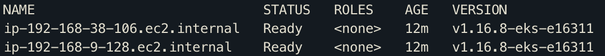

# Spring Boot na AWS com Kubernetes

## Infrastructure

We have 2 steps to set up our infrastructure, the first one we'll use [Terraform](https://www.terraform.io/) and 
the second one [eksctl](https://eksctl.io/).

### eksctl

#### Installation

Follow the instructions here https://eksctl.io/introduction/#installation

For macOS we can use Homebrew:

````
brew tap weaveworks/tap
brew install weaveworks/tap/eksctl
````

- Version used: 0.22.0

#### Cluster creation

If you don't use default profile, use --profile flag

````
eksctl create cluster -f eks-hibicode-cluster.yaml --kubeconfig=./kubeconfig.cluster.yaml --profile hibicode
````

Export KUBECONFIG variable to use kubectl:

````
export KUBECONFIG=$PWD/kubeconfig.cluster.yaml
````

Check nodes:

````
kubectl get nodes
````



### Terraform

#### Installation

It's very simple, just download, unzip and add it to path. Download it [here](https://www.terraform.io/downloads.html).

- Version used: v0.12.28

#### Running

After create the EKS cluster, we can run Terraform to provisioning some services like ECR and RDS.

````
terraform init
terraform apply
````

### Dockerizing and pushing the app

Build application:

````
docker build -t personal-load .
````

Login to ECR:

Use _ecr_uri_ without the last /hibicode word from Terraform output to run the command:

````
aws ecr get-login-password --region us-east-1 --profile hibicode | docker login --username AWS --password-stdin <ecr_uri>
````

After our build and login successfully, we can tag our image (now use the full ecr_url):

````
docker tag personal-loan:latest <ecr_uri>:latest
````

Then push our image (use full ecr_uri):

````
docker push <ecr_uri>:latest
````
